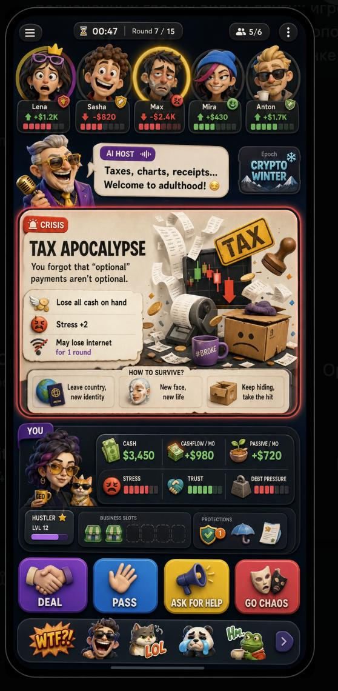

# DYOR Fast Local Prototype Plan 2026-05-28

Purpose: prepare a one-day prototype that can run locally on a laptop and be opened from 2-6 phones on the same Wi-Fi, so the gameplay can be tested and discussed before art, animation, Telegram review, or production infrastructure.

Reference screenshot:



## Context Read Before Planning

Relevant existing docs:

- `README.md`: DYOR is a Telegram Mini App social financial strategy game. First goal is stable multiplayer game logic, not AI video host.
- `docs/agents/AGENT_START_HERE.md`: separate project from Covariant; do not mix embedded/LoRa context into this repo.
- `docs/second_brain/10_game_design/MVP_INTENT.md`: 2-6 players, 25-45 min main match, 10-15 min tutorial sprint, mobile portrait first.
- `docs/second_brain/20_mechanics/GAME_MECHANICS_MVP.md`: core loop, player state, business slots, deposits, crypto/futures, assistants, non-obvious deals, interest windows, bot replacement.
- `docs/second_brain/10_game_design/MOBILE_UI_DIRECTION.md`: main screen layout: player strip, AI host, card stage, player dashboard, action buttons, reaction rail.
- `docs/second_brain/10_game_design/CHARACTER_VISUAL_STYLE_PROMPT.md`: toy-comic avatar direction, but full art/animation is not needed for the fast prototype.
- `docs/second_brain/60_risks/MVP_SCOPE_VERDICT_2026-05-23.md`: v1 scope, server-authoritative engine, no board/dice movement, same engine for single and online.
- `.planning/phases/PHASE_1_ENGINE_SPEC.md`: deterministic extensible engine, typed effects, replayable event log.
- `.planning/research/FINANCIAL_GAME_RESEARCH.md`: borrow patterns without copying protected rules, art, names, cards, or board.

Important conclusion: tomorrow's build is not an embedded prototype and not a long online board-game clone. It is a local Telegram-like mobile web prototype with room creation, synchronous session flow, deterministic rules, and placeholder characters.

## Hard Prototype Boundary

Do:

- Build a phone-first web app that opens from a local LAN URL.
- Allow 2-6 devices to join the same room by room code/URL.
- Add a single-player room with bots using the same engine.
- Use emoji/static placeholder avatars for character outfit, emotion, and status changes.
- Reproduce the layout and pacing of the reference screenshot: top player strip, host bubble, event/card area, dashboard, four action buttons, reaction rail.
- Keep game logic server-authoritative in online mode.
- Keep all cards and effects fictional.

Do not:

- Generate final character art.
- Animate avatars or cards beyond simple CSS state changes.
- Build Bluetooth as the critical path. Browser/Bluetooth inside Telegram Mini Apps is not a reliable tomorrow path. Use same-Wi-Fi local server.
- Copy Cashflow, Monopoly, Monopoly GO, Pandemic, Spirit Island, Gloomhaven, Stockpile, or any other game's protected names, boards, cards, art, or exact rules.
- Make real investment recommendations or real-market signals.
- Build payments, ranking, AI video, voice, Rive, Lottie, Postgres, or Telegram production auth for the one-day prototype.

## Local Test Target

Target experience:

1. Host runs local server on laptop.
2. Host opens `http://<laptop-lan-ip>:5173` on phone or desktop.
3. Player creates room and gets room code/link.
4. 2-6 phones join on the same Wi-Fi.
5. Players select placeholder characters, outfit/emotion/status variants.
6. Host starts match.
7. Everyone sees the same round, timer, crisis/deal card, player strip, dashboard, and reaction rail.
8. No player can advance to the next round alone. The server advances only after all required intents arrive or the shared timer expires.

Fallback if WebSocket is flaky on a network:

- Support "same device multi-seat" debug mode with 2-6 browser tabs.
- Support bot fill for empty seats.

## Minimal Architecture

Recommended one-day repo shape:

```text
apps/web/
  Vite + React mobile UI
  Zustand or simple reducer store
  WebSocket client
  Telegram WebApp bridge mocked for local mode

apps/server/
  Fastify HTTP server
  ws WebSocket room server
  in-memory room store for prototype
  serves room state snapshots and accepted commands

packages/shared/
  zod schemas or TypeScript types:
    PlayerState
    MatchState
    Command
    GameEvent
    CardDefinition
    EffectDefinition

packages/game-engine/
  pure deterministic engine:
    createMatch(seed, players)
    validateCommand(state, command)
    resolveCommand(state, command)
    advancePhase(state)
    botIntent(state, botPlayer)

packages/sim/
  small CLI smoke test:
    run 10 bot matches
    assert no negative impossible state
```

Prototype storage:

- In-memory only for the first local test.
- Export/import match log as JSON button if useful.
- No database until the core flow feels right.

## Core Loop For Tomorrow

Use a round-barrier model:

1. `round_start`: market pulse/event selected from deterministic deck.
2. `settlement`: income/expenses/passive income applied.
3. `decision_window`: active card appears.
4. `intent_window`: every player can submit exactly one relevant intent:
   - active player: deal/pass/ask_help/go_chaos/choice option;
   - non-active players: help/invest/react/decline/watchlist/predict.
5. `resolution`: server resolves all intents in a deterministic order.
6. `host_summary`: template line explains outcome.
7. `round_end`: advance only when all clients have caught up or after a short sync timeout.

Fairness rule:

- The UI may let people react at different speeds, but the engine advances in shared phases. No player gets to be one turn ahead.
- Timed defaults prevent waiting: if a player does nothing, the server inserts `auto_pass` or bot policy at timeout.

## Borrowable Mechanics Without Copying

Research anchors:

- Telegram Mini Apps official docs: main Mini Apps support shared usage by multiple chat members for multiplayer/teamwork services; server must validate `Telegram.WebApp.initData`.
  - https://core.telegram.org/bots/webapps
- Pandemic pattern: accessible co-op pressure, limited actions, escalating system threat after player actions.
  - https://en.wikipedia.org/wiki/Pandemic_(board_game)
- Spirit Island / Gloomhaven-style pattern: simultaneous planning or card/intent selection reduces idle waiting, then rules resolve actions in an ordered phase.
  - https://boardgamegeek.com/boardgame/162886/spirit-island
- Daybreak pattern: cooperative crisis theme with individual player capacities and shared global pressure.
  - https://en.wikipedia.org/wiki/Daybreak_(board_game)
- Existing project research: fast reward loops, structured negotiation, partial information, bot replacement, ethical gamification boundaries.
  - `.planning/research/FINANCIAL_GAME_RESEARCH.md`

Concrete DYOR adaptations:

- From co-op games: shared crisis meter/epoch pressure, but each player keeps personal cashflow goals.
- From simultaneous-turn games: everyone submits intents inside the same phase, then server resolves.
- From auction/negotiation games: short interest window before negotiation, not open chat chaos.
- From mobile retention loops: quick state changes, recap, reactions, rematch, invite link.
- From financial education: immediate visible cause/effect, not a spreadsheet lesson.

## Placeholder Character System

Goal: test outfit/emotion/status switching without final art.

Use data-driven placeholders:

```ts
type CharacterMood =
  | "stable"
  | "happy"
  | "stressed"
  | "overworked"
  | "tax_panic"
  | "overleveraged"
  | "cardboard"
  | "passive_calm"
  | "chaos";

type Outfit =
  | "hustler"
  | "office"
  | "creator"
  | "trader"
  | "operator"
  | "nomad";

type Status =
  | "ready"
  | "thinking"
  | "locked"
  | "helping"
  | "broke"
  | "debt"
  | "protected"
  | "bot";
```

Emoji mapping example:

```ts
const moodEmoji = {
  stable: ":)",
  happy: ":D",
  stressed: ">:(",
  overworked: "x_x",
  tax_panic: "o_o",
  overleveraged: "!!",
  cardboard: "[]",
  passive_calm: "tea",
  chaos: "mask",
};
```

UI display can use plain text or safe emoji where supported:

- outfit badge: `HUSTLER`, `TRADER`, `CREATOR`;
- mood token: `:)`, `x_x`, `TAX!`, `BOX`, `CALM`;
- status pill: `READY`, `LOCKED`, `BOT`, `HELP`;
- color ring: green/red/yellow/purple;
- small props as text chips: `cash`, `debt`, `tax`, `shield`, `cat`.

Important: do not generate or animate final characters during this stage. The prototype should prove that state changes are readable before art money is spent.

## Minimum Card Set

For a useful 30-minute test, implement 12 cards:

- 3 opportunities:
  - Storage Pod Investment
  - AI Template Shop
  - Local Service Route
- 3 crises:
  - Tax Apocalypse
  - Internet Down
  - Rent Spike
- 2 protections:
  - Accountant Shield
  - Emergency Fund
- 2 social cards:
  - Co-Investment Offer
  - Ask For Help
- 2 market pulse events:
  - Crypto Winter
  - Boring Businesses Boom

Each card should be a data object with:

- title;
- type;
- short text;
- 2-4 consequences;
- 2-3 choices;
- effect list;
- host cue id;
- placeholder art token.

## One-Day Build Order

1. Scaffold local app and server.
   - `apps/server` Fastify + ws.
   - `apps/web` Vite + React.
   - local dev command starts both.

2. Shared schemas.
   - players, rooms, commands, events, cards.
   - keep fields close to `PHASE_1_ENGINE_SPEC.md`, but only resolve the fields needed tomorrow.

3. Deterministic engine slice.
   - match creation;
   - fixed seed;
   - draw card;
   - apply effects;
   - round barrier;
   - bot auto-pass.

4. Room flow.
   - create room;
   - join by code;
   - pick placeholder character;
   - ready/start;
   - reconnect by local player id in `localStorage`.

5. Main Turn Table UI.
   - match screenshot layout;
   - player strip;
   - timer/round;
   - host bubble;
   - epoch banner;
   - big card;
   - dashboard;
   - action row;
   - reaction rail.

6. Multiplayer sync.
   - server broadcasts snapshot after every accepted command;
   - client renders pending/locked state;
   - no local money math.

7. LAN verification.
   - run on `0.0.0.0`;
   - test desktop + 2 phones;
   - test one disconnected player -> bot/default action;
   - test all players cannot drift to different rounds.

## Acceptance Criteria

Prototype is successful if:

- `pnpm dev` or equivalent starts local server and web app.
- A room can be created and joined from at least 2 phones on the same Wi-Fi.
- 2-6 seats can be filled with humans or bots.
- Everyone sees the same `round`, `phase`, `timer`, and card.
- The active card can be resolved by button commands.
- Non-active players have something to do every round: react, help, invest, or pass.
- A player who does nothing is auto-passed at timeout.
- Character placeholder state changes are visible: outfit, mood, status, cashflow/stress/debt.
- The layout clearly follows the founder reference screenshot.
- The engine can run the same match with bots in single-player mode.

## Open Decisions After First Test

- Should the game be competitive only, co-op only, or "shared crisis + personal winner"?
- Should every player always submit an intent, or only when eligible?
- What is the ideal decision window: 30, 45, 60, or 90 seconds?
- Which actions are fun when it is not your turn?
- Is `GO CHAOS` a room-mode action, a one-time risk action, or a character trait?
- Does the cat/pet have mechanics in the first prototype or only visual feedback?
- Does the AI host speak after every resolution or only on high-impact events?

